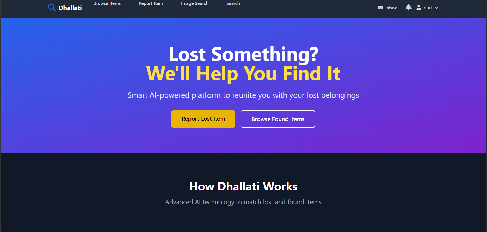
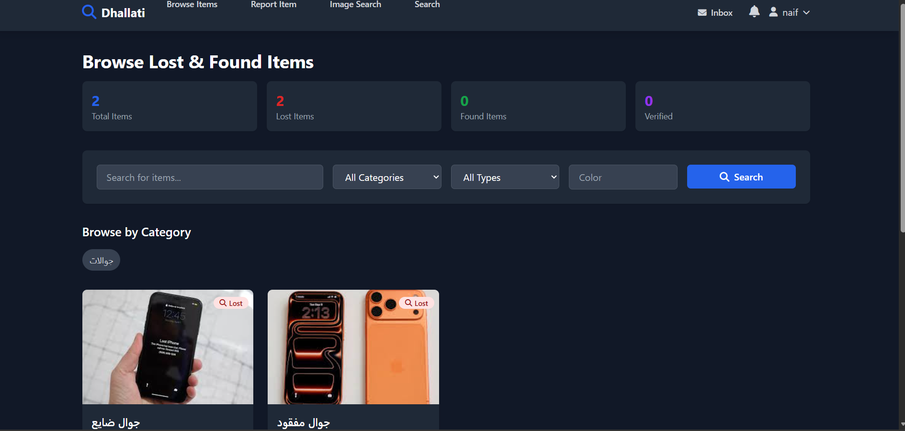
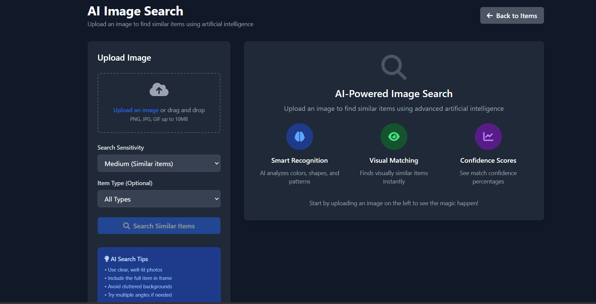
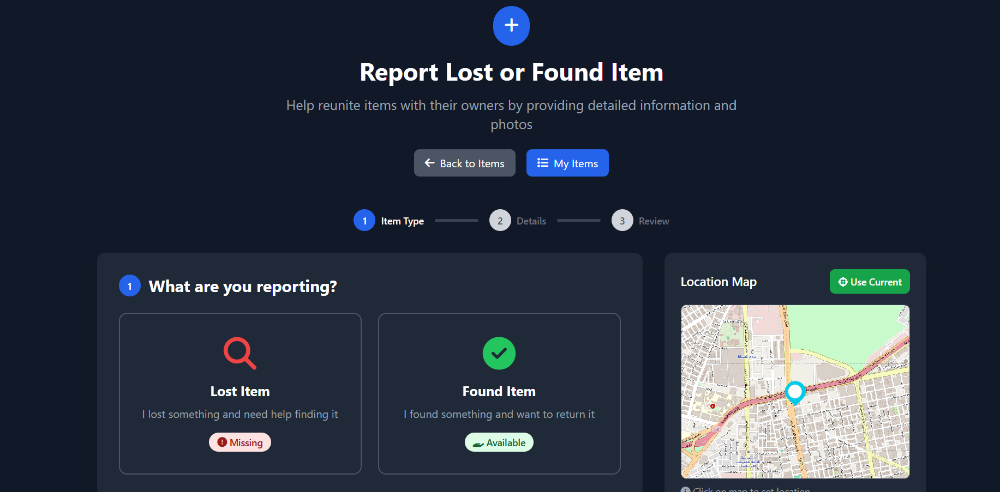
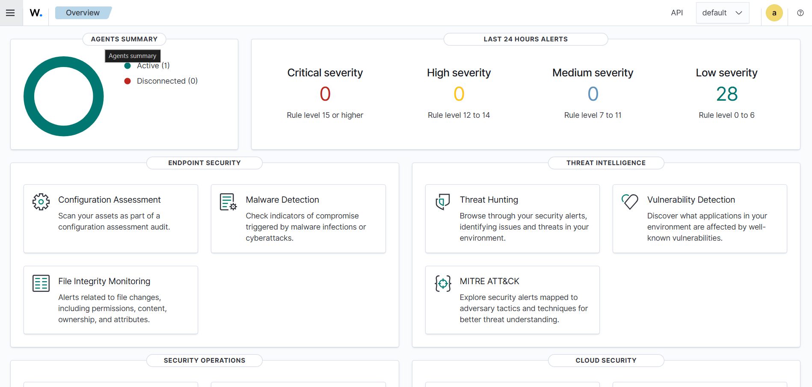
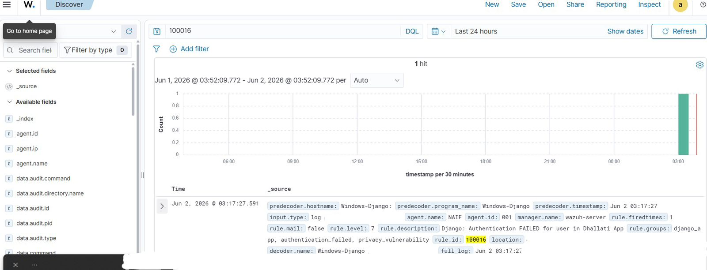
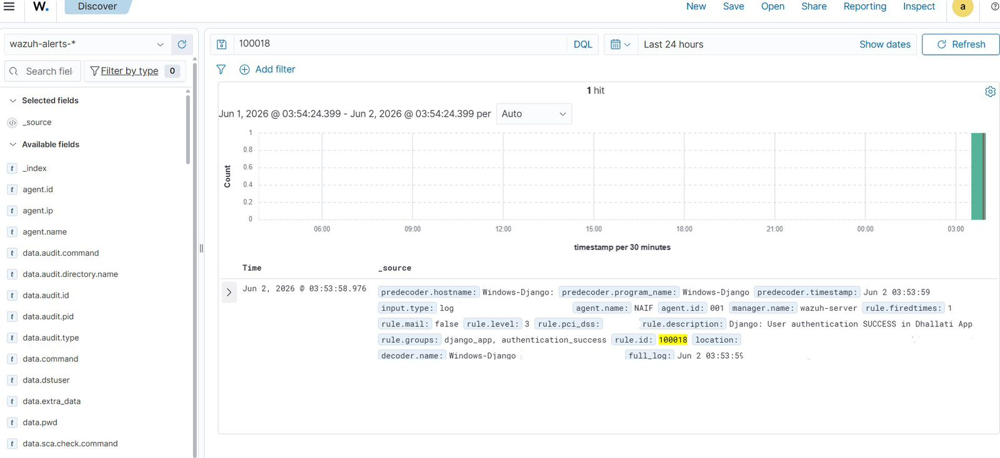

# ضالتي — Dhallati 🔍
### AI-Powered Lost & Found Platform with Integrated Security Monitoring

> A full-stack web platform that combines artificial intelligence and cybersecurity to streamline lost item recovery — built as a graduation project with real-world security integration.

---

## 📌 Project Overview

**Dhallati** (ضالتي) is a centralized lost and found platform designed to bridge the gap between people who lose items and those who find them. The platform leverages AI for intelligent item matching and integrates enterprise-grade security monitoring via Wazuh SIEM. The project was developed with full SDLC ownership—from architectural design to on-premise deployment, security hardening, and real-time threat monitoring.

---

## ✨ Key Features

| Feature | Description |
|---|---|
| 🤖 AI Image Matching | Converts uploaded images to feature vectors; achieves **95% match accuracy** using OpenCV/PyTorch |
| 🔍 Semantic Text Search | Finds items based on natural language descriptions using Sentence-Transformers |
| 📍 Location-Based Reporting | Interactive map integration for tagging lost/found locations |
| 📬 Real-Time Messaging | Built-in inbox for direct communication between users |
| 🛡️ SIEM Integration | Wazuh agent monitors authentication events with custom detection rules |
| 🔐 RBAC & Access Control | Role-based access control enforced throughout the application |

---

## 🛠️ Tech Stack

**Backend**
- Python (Django) — REST API & business logic
- MySQL — relational data storage
- Wazuh SIEM — security monitoring & threat detection

**AI / Machine Learning**
- Sentence-Transformers — semantic text search
- OpenCV / PyTorch — image feature extraction & similarity matching

**Frontend**
- HTML / CSS / JavaScript
- Interactive map (location tagging)

**Security**
- OWASP Top 10 mitigations
- RBAC (Role-Based Access Control)
- Custom Wazuh rules for Django authentication events
- Authentication failure detection (Rule ID: 100016)
- Authentication success logging (Rule ID: 100018)

---

## 🧠 AI Matching — How It Works

```
User uploads image
        ↓
Image → Feature Vector (OpenCV/PyTorch)
        ↓
Compare against all stored item vectors
        ↓
Return matches ranked by similarity score
        ↓
95% accuracy on visually similar items
```

The system tolerates natural variations between photos (angle, lighting, background) while maintaining high match confidence.

---

## 🛡️ Security Architecture

### Wazuh SIEM Integration
The application is monitored by a Wazuh agent configured to parse Django authentication logs in real time.

**Custom Detection Rules:**

| Rule ID | Event | Severity |
|---|---|---|
| 100016 | Authentication FAILED in Dhallati App | Level 7 |
| 100018 | Authentication SUCCESS in Dhallati App | Level 3 |

**Monitored events include:**
- Login failures (potential brute force)
- Successful logins (session tracking)
- Privacy vulnerability group tagging

### Security Measures
- ✅ OWASP Top 10 vulnerabilities mitigated
- ✅ RBAC enforced on all endpoints
- ✅ Input validation & SQL injection prevention
- ✅ Secure session management

---

## 📸 Screenshots

### Home Page


### Browse Lost & Found Items


### AI Image Search


### Report Item (Multi-step with Map)


### Inbox / Messaging


### Wazuh SIEM — Authentication Monitoring


### Auth Failed Alert 


### Auth Success Alert


---

## 🏗️ System Architecture

```
┌─────────────────────────────────────┐
│           Django Web App            │
│  ┌──────────┐  ┌──────────────────┐ │
│  │   RBAC   │  │  AI Engine       │ │
│  │  Auth    │  │  Sentence-Trans  │ │
│  │  System  │  │  OpenCV/PyTorch  │ │
│  └──────────┘  └──────────────────┘ │
│         ↓               ↓           │
│    ┌─────────┐    ┌──────────┐      │
│    │  MySQL  │    │  Media   │      │
│    │   DB    │    │ Storage  │      │
│    └─────────┘    └──────────┘      │
└──────────────┬──────────────────────┘
               │ Auth Logs
               ↓
┌──────────────────────────────────────┐
│         Wazuh SIEM Agent             │
│  Monitors: dhallati.log              │
│  Custom Rules: 100016, 100018        │
│  Alerts: Auth failures & successes   │
└──────────────────────────────────────┘
```

---

## 🚀 Project Highlights

- **95% image match accuracy** using vector similarity
- **Custom SIEM rules** built from scratch for Django application monitoring
- **Full SDLC ownership** — architecture, development, security, deployment
- **Dual AI approach** — both visual (image) and semantic (text) search
- **Real-world security integration** — not just theoretical

---

## 📁 Repository

> 🔒 **This repository is private.**
> The full source code is available upon request for review purposes.
> Please contact via LinkedIn .

---

## 👤 Author

**Naif AlOtaibi**
Cybersecurity Specialist | Majmaah University — Jan 2026

[](https://www.linkedin.com/in/naif-al-otaibi-cybersecurity)

---

*Built with security-first mindset — from threat detection to application hardening.*
